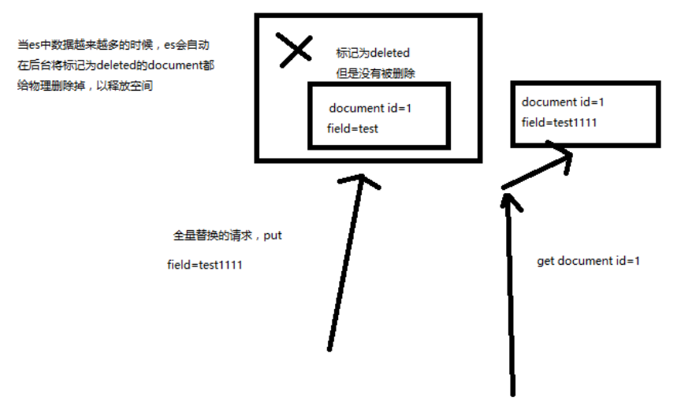

# CRUD、强制操作

document 的全量替换、强制创建以及图解 lazy delete 机制

[[toc]]

1. document 的全量替换
2. document 的强制创建
3. document 的删除

## document 的全量替换


1. 语法与创建文档是一样的

    如果 document id 不存在，那么就是创建；如果 document id 已经存在，那么就是全量替换操作，替换 document 的 json 串内容
2. document 是不可变的

    如果要修改 document 的内容，第一种方式就是全量替换，直接对 document 重新建立索引，替换里面所有的内容
3. es 会将老的 document 标记为 deleted

    然后新增我们给定的一个 document，当我们创建越来越多的 document 的时候，es 会在适当的时机在后台自动删除标记为 deleted 的 document



## document 的强制创建

老师讲解的是：


1. 创建文档与全量替换的语法是一样的，有时我们只是想新建文档，不想替换文档，如果强制进行创建呢？
2. `PUT /index/type/id?op_type=create，PUT /index/type/id/_create`

-------------

```json
PUT /test_index/test_type/1/_create
{
  "test_content": "test test",
  "test_content2": "test test23"
}

PUT /test_index/test_type/1?op_type=create
{
  "test_content": "test test",
  "test_content2": "test test23",
  "test_content3": "test test23"
}
```
## document 的强制创建（正确的讲解）

我觉得上面讲解得有问题：

如果已经存在一个 document id 为 1 的时候，再使用以上语法创建，会报错;

会告诉你已经存在了；

那么这个的含义应该是：当你不想要覆盖操作的时候，可以使用 create 显示指定不要覆盖，而是报错

```json
{
  "error": {
    "root_cause": [
      {
        "type": "version_conflict_engine_exception",
        "reason": "[test_type][1]: version conflict, document already exists (current version [3])",
        "index_uuid": "g4RJx2v8TXK95LdwlhRx5A",
        "shard": "2",
        "index": "test_index"
      }
    ],
    "type": "version_conflict_engine_exception",
    "reason": "[test_type][1]: version conflict, document already exists (current version [3])",
    "index_uuid": "g4RJx2v8TXK95LdwlhRx5A",
    "shard": "2",
    "index": "test_index"
  },
  "status": 409
}
```

## document 的删除

```json
DELETE /test_index/test_type/1
```

这里的删除和更新操作类似，也是一个 lazy delete 机制
