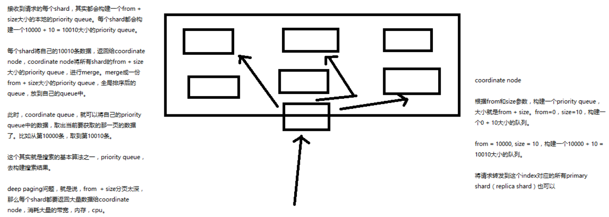

# 分布式搜索引擎内核解密之 query phase
[[toc]]

## query phase

1. 搜索请求发送到某一个 coordinate node，构构建一个 priority queue，长度以 paging 操作 from 和 size 为准，默认为 10
2. coordinate node 将请求转发到所有 shard，每个 shard 本地搜索，并构建一个本地的 priority queue
3. 各个 shard 将自己的 priority queue 返回给 coordinate node，并构建一个全局的 priority queue

这个流程就叫 query phase （查询阶段）

::: tip
这个过程还是经典的做法，有一个节点来做聚合，所以就会有单节点聚合占用资源过多的情况发生
:::

## replica shard 如何提升搜索吞吐量

一次请求要打到所有 shard 的一个 replica/primary 上去，如果每个 shard 都有多个 replica，那么同时并发过来的搜索请求可以同时打到其他的 replica 上去

::: tip 疑问
还是同步问题，这个还是不知道 es 是怎么保证在快速同步的，并且查询还没有问题的？不明白
:::
