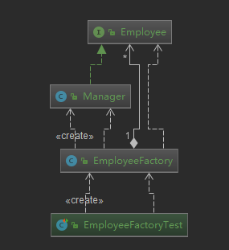

# 享元模式 Flyweight
**定义**：提供了减少对象数量从而改善应用所需的对象结构方式

  运用共享技术有效地支持大量细粒度的对象。

  简单说，减少对象的创建，降低内存占用，提供系统性能

**类型**：结构型


## 适用场景

- 常常应用于系统底层的开发，以便解决系统的性能问题

  如：JAVA string，有则返回，无则创建 字符串，并放入缓存里
  如：连接池
- 系统有大量相似对象、需要缓冲池的场景


简单说：有大量需要被共享的时候，才有意义使用享元模式，否则就是杀鸡焉用牛刀  

## 优点

- 减少对象的创建，降低内存中对象的数量，降低系统的内存，提高效率
- 减少内存之外的其他资源占用

  其他资源？操作系统中的文件句柄，除了对象占用内存外，还占用系统资源

## 缺点

- 关注内/外部状态、关注线程安全问题
- 使系统、程序的逻辑复杂化

## 扩展

- 内部状态：在享元对象内部，不会随着环境的改变而改变的部分
- 外部状态：随着环境改变而改变的就属于外部状态，是不可共享的状态

举例来说：一个滑雪板，内部状态：名称=滑雪板，外部状态：租借价格，根据 VIP 级别价格是随着 VIP 级别改变而改变的，普通人来租借滑雪板需要 100， vip 来租借就只需要 50，而内部状态始终都不会变化。

## 相关设计模式

- 代理模式

  如果代理模式生成的一个类花费时间比较多，适合场景下就可以使用享元模式来提高处理速度
- 单例模式

  容器单例，复用对象
## 代码

场景：慕课让各个部门经理做报表；

如果该部门经理对象已经生成过了,就不需要再生成了，也会结合工厂模式

```java
/**
 * 员工接口
 *
 * @author : zhuqiang
 * @date : 2018/12/25 22:58
 */
public interface Employee {
    void report();
}
// 经理
public class Manager implements Employee {
    /**
     * 部门固定
     */
    private String department;
    /**
     * 报告内容经常变更
     */
    private String reportContent;

    public Manager(String department) {
        this.department = department;
    }

    public String getDepartment() {
        return department;
    }

    public void setReportContent(String reportContent) {
        this.reportContent = reportContent;
    }

    @Override
    public void report() {
        System.out.println(reportContent);
    }

    public void setDepartment(String department) {
        this.department = department;
    }
}
```

```java
/**
 * 享元工厂
 *
 * @author : zhuqiang
 * @date : 2018/12/25 23:02
 */
public class EmployeeFactory {
    private final static Map<String, Employee> EMPLOYEE_MAP = new HashMap<>();

    public Employee getManger(String department) {
        Manager manager = (Manager) EMPLOYEE_MAP.get(department);
        if (manager == null) {
            manager = new Manager("department");
            System.out.print("创建部门经理 " + department);
            String reportContent = " 部门汇报：内容是...";
            manager.setReportContent(reportContent);
            System.out.println(" 创建报告 " + reportContent);
            EMPLOYEE_MAP.put(department, manager);
        }
        return manager;
    }
}
```

测试，可以看到当使用次数多，假如创建报告是很费时间的，那么这里就能节省很多时间，
但是，这里我怎么感觉和缓存一样呢？难道说缓存就是享元模式么
```java
// 假设有 4 个部门
private String[] departments = {"RD", "QA", "BI", "DB"};

@Test
public void fun1() {
    // 总共做十次汇报，每次随机叫一个经理做
    // 这里的内容都是一样的
    EmployeeFactory factory = new EmployeeFactory();
    for (int i = 0; i < 10; i++) {
        int index = (int) (Math.random() * departments.length);
        factory.getManger(departments[index]).report();
    }
}

=====================

创建部门经理 QA 创建报告  部门汇报：内容是...
 部门汇报：内容是...
 部门汇报：内容是...
创建部门经理 DB 创建报告  部门汇报：内容是...
 部门汇报：内容是...
 部门汇报：内容是...
创建部门经理 BI 创建报告  部门汇报：内容是...
 部门汇报：内容是...
 部门汇报：内容是...
 部门汇报：内容是...
 部门汇报：内容是...
创建部门经理 RD 创建报告  部门汇报：内容是...
 部门汇报：内容是...
 部门汇报：内容是...
```



关于内部外部状态这个例子，让我有点懵逼，可能是这个例子太简单了，不太好阐述清楚；

示例中说：如果再给经理对象增加一个属性 title = “部门经理” ，那么这个 title 就是内部状态，因为是不变的，而部门名称是通过外部传入的就是外部状态。

## 源码解析

java.lang.Integer#valueOf(int)

在范围内则从缓存中获取，这就是一个享元模式的使用
```java
// range -128 to 127
public static Integer valueOf(int i) {
    if (i >= IntegerCache.low && i <= IntegerCache.high)
        return IntegerCache.cache[i + (-IntegerCache.low)];
    return new Integer(i);
}
```

org.apache.commons.pool2.impl.GenericObjectPool

```java
@Override
public T borrowObject() throws Exception {
    return borrowObject(getMaxWaitMillis());
}

public T borrowObject(final long borrowMaxWaitMillis) throws Exception {
        assertOpen();

        final AbandonedConfig ac = this.abandonedConfig;
        if (ac != null && ac.getRemoveAbandonedOnBorrow() &&
                (getNumIdle() < 2) &&
                (getNumActive() > getMaxTotal() - 3) ) {
            removeAbandoned(ac);
        }

        PooledObject<T> p = null;

        // Get local copy of current config so it is consistent for entire
        // method execution
        final boolean blockWhenExhausted = getBlockWhenExhausted();

        boolean create;
        final long waitTime = System.currentTimeMillis();

        while (p == null) {
            create = false;
            p = idleObjects.pollFirst();
            if (p == null) {
                p = create();
                if (p != null) {
                    create = true;
                }
            }
            if (blockWhenExhausted) {
                if (p == null) {
                    if (borrowMaxWaitMillis < 0) {
                        p = idleObjects.takeFirst();
                    } else {
                        p = idleObjects.pollFirst(borrowMaxWaitMillis,
                                TimeUnit.MILLISECONDS);
                    }
                }
                if (p == null) {
                    throw new NoSuchElementException(
                            "Timeout waiting for idle object");
                }
            } else {
                if (p == null) {
                    throw new NoSuchElementException("Pool exhausted");
                }
            }
            if (!p.allocate()) {
                p = null;
            }

            if (p != null) {
                try {
                  // 通过 工厂操作
                    factory.activateObject(p);
                } catch (final Exception e) {
                    try {
                        destroy(p);
                    } catch (final Exception e1) {
                        // Ignore - activation failure is more important
                    }
                    p = null;
                    if (create) {
                        final NoSuchElementException nsee = new NoSuchElementException(
                                "Unable to activate object");
                        nsee.initCause(e);
                        throw nsee;
                    }
                }
                if (p != null && (getTestOnBorrow() || create && getTestOnCreate())) {
                    boolean validate = false;
                    Throwable validationThrowable = null;
                    try {
                        validate = factory.validateObject(p);
                    } catch (final Throwable t) {
                        PoolUtils.checkRethrow(t);
                        validationThrowable = t;
                    }
                    if (!validate) {
                        try {
                            destroy(p);
                            destroyedByBorrowValidationCount.incrementAndGet();
                        } catch (final Exception e) {
                            // Ignore - validation failure is more important
                        }
                        p = null;
                        if (create) {
                            final NoSuchElementException nsee = new NoSuchElementException(
                                    "Unable to validate object");
                            nsee.initCause(validationThrowable);
                            throw nsee;
                        }
                    }
                }
            }
        }

        updateStatsBorrow(p, System.currentTimeMillis() - waitTime);

        return p.getObject();
    }
```
通过各种判断，缓存中，再结合工厂管理生命周期，这个也可以看成是享元模式的一个应用
```java
public interface PooledObjectFactory<T> {

  // 创建
  PooledObject<T> makeObject() throws Exception;
  // 注销
  void destroyObject(PooledObject<T> p) throws Exception;

  // 验证
  boolean validateObject(PooledObject<T> p);

  // 激活
  void activateObject(PooledObject<T> p) throws Exception;
  // 钝化
  void passivateObject(PooledObject<T> p) throws Exception;
}
```
