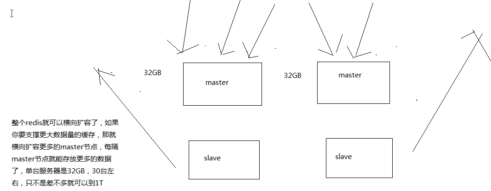

# 026. redis 如何在保持读写分离+高可用的架构下，还能横向扩容支撑 1T + 海量数据

## 课程前说明
后面几个章节会老提到 读写分离和 master。之前的课程讲解中说了读写分离后的水平扩容是通过扩容 slave 来达到的。

但是在实际生产环境中，读写分离支持不是很好，特别的 java 这种客户端，可以做到但是稍微复杂

这里的说明其实我也没有太听明白，记住一条信息：通过 master 去扩容的，至于为什么，后面大概 29 讲的时候会讲解

## 单机 redis 在海量数据面前的瓶颈
之前讲解的一主多从架构，master 的瓶颈

这种架构的瓶颈只是解决了 QPS，但是没有解决海量数据的问题

单机 32G 内存，假如我们就希望存储 1T 的数据呢？

## 怎么才能够突破单机瓶颈，让 redis 支撑海量数据？

这个没有看明白是怎么怎么实际上能支撑海量数据的，难道是要通过路由均衡负载？

## redis 的集群架构

redis cluster

支撑 N 个 redis master node，每个 master node 都可以挂载多个 slave node

简单说：redis cluster = 多 master + 读写分离 + 高可用

我们只要基于 redis cluster 去搭建 redis 集群即可，不需要手工去搭建 replication 复制+主从架构+读写分离+哨兵集群+高可用

## redis cluster vs replication + sentinal

如果你的数据量很少，主要是承载高并发高性能的场景，比如你的缓存一般就几个 G，单机足够了

- replication

    一个 mater，多个 slave，要几个 slave 跟你的要求的读吞吐量有关系，然后自己搭建一个 sentinal 集群，去保证 redis 主从架构的高可用性，就可以了

- redis cluster

    主要是针对海量数据+高并发+高可用的场景，海量数据，如果你的数据量很大，那么建议就用 redis cluster
