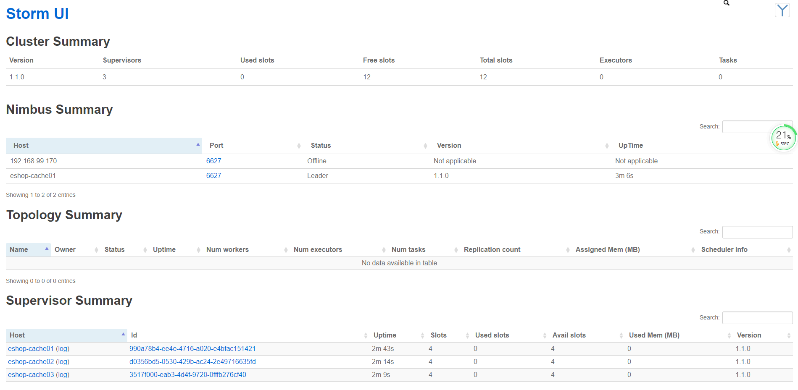

# 066. 纯手工集群部署

## 确认是否安装了依赖

- java 1.7 +
- pythong 2.6.6 该软件之前被安装过

## storm 安装

```
cd /usr/local
tar -zxvf apache-storm-1.1.0.tar.gz
mv apache-storm-1.1.0 storm

# 配置环境变量，添加 /usr/local/bin
vi ~/.bashrc
source ~/.bashrc

# 查看 storm 版本
storm version
```

## 修改 storm 配置文件

```
mkdir /var/storm
vi /usr/local/storm/conf/storm.yaml
# 需要修改的配置内容如下：
# -------------------------
storm.zookeeper.servers:
     - "192.168.99.170"
     - "192.168.99.171"
     - "192.168.99.172"
# storm.zookeeper.port: 2181
nimbus.seeds: ["192.168.99.170"]

storm.local.dir: "/var/storm"

# 指定每个机器上可以启动多少个 worker，一个端口号代表一个
supervisor.slots.ports:
    - 6700
    - 6701
    - 6702
    - 6703

# -------------------------
```

一台装好了，再装另外的几台，通过 scp 命令 copy

```
scp ~/.bashrc root@eshop-cache02:~/
scp -r /usr/local/storm/ root@eshop-cache02:/usr/local/

并创建 mkdir /var/storm 和刷新环境变量文件 source ~/.bashrc
```

一共创建三个节点：在 eshop-cache01、eshop-cache02、eshop-cache03

## 启动 storm 集群和 ui 界面

```
# 一个节点 在 01 上
storm nimbus >/dev/null 2>&1 &
# 三个节点
storm supervisor >/dev/null 2>&1 &
# 也是需要三个节点，否则在 ui 中访问 8000 端口的日志浏览会404
storm logviewer > /dev/null 2>&1 &
# 一个节点 在 01 上
storm ui >/dev/null 2>&1 &

# 可以通过 jps 命令查看是否已经启动
[root@eshop-cache01 conf]# jps
10116 Jps
1576 Kafka
1447 QuorumPeerMain
9944 nimbus   这里已经被启动了
```

ui 访问地址：`http://eshop-cache01:8080/index.html`


